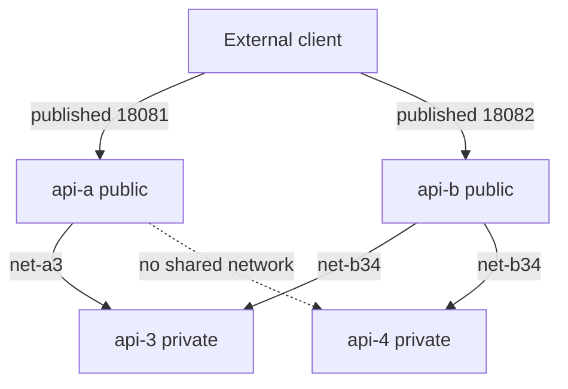
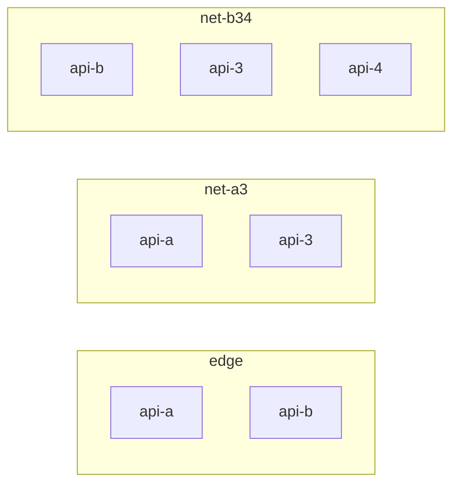

# cc-demo-apis

Four tiny ASP.NET Core APIs for exercising ContainerControl public-versus-private services and Docker network access control.

| Service | Role | Published to the host | Networks |
|---------|------|------------------------|----------|
| **api-a** | Public edge | `18081:8080` | `edge`, `net-a3` |
| **api-b** | Public edge | `18082:8080` | `edge`, `net-b34` |
| **api-3** | Private | none | `net-a3`, `net-b34` |
| **api-4** | Private | none | `net-b34` |

Access is enforced by Docker networks, not by application filters:

- External clients can open only api-a and api-b.
- api-3 and api-4 have no host ports and are not on `edge`.
- api-a can call api-3 (`net-a3`) and cannot resolve api-4 (no shared network).
- api-b can call both api-3 and api-4 (`net-b34`).

Each service is a .NET 8 minimal API listening on port **8080**, with Swagger UI at `/swagger`.

## Architecture





## Images

These tags are the Hub names to pull. This repo does not push them.

| Service | Image |
|---------|--------|
| api-a | `bhuvaneshsaha/cc-demo-api-a:latest` |
| api-b | `bhuvaneshsaha/cc-demo-api-b:latest` |
| api-3 | `bhuvaneshsaha/cc-demo-api-3:latest` |
| api-4 | `bhuvaneshsaha/cc-demo-api-4:latest` |

```bash
docker pull bhuvaneshsaha/cc-demo-api-a:latest
docker pull bhuvaneshsaha/cc-demo-api-b:latest
docker pull bhuvaneshsaha/cc-demo-api-3:latest
docker pull bhuvaneshsaha/cc-demo-api-4:latest
```

Build locally (no push):

```bash
docker compose build
```

## Run

```bash
docker compose up --build
```

`docker-compose.yml` builds all four services and publishes only:

- api-a → `http://localhost:18081`
- api-b → `http://localhost:18082`

Upstream base URLs default to `API3_URL=http://api-3:8080` and `API4_URL=http://api-4:8080`.

## HTTP surface

| Method | Path | Services | Body |
|--------|------|----------|------|
| GET | `/` | all | `{ "name": "...", "role": "public" \| "private" }` |
| GET | `/health` | all | `{ "service": "...", "status": "ok" }` |
| GET | `/swagger` | all | Swagger UI |
| GET | `/call/api3` | api-a, api-b | upstream `/health` status and body |
| GET | `/call/api4` | api-a, api-b | upstream `/health`, or `{ "ok": false, "reason": "..." }` when the call cannot connect |

`/call/api4` on api-a is expected to fail closed. The process stays up and returns JSON.

## Verify

Start the stack, then:

```bash
# Public edge APIs
curl -sS http://localhost:18081/health
curl -sS http://localhost:18081/
curl -sS http://localhost:18082/health
curl -sS http://localhost:18082/
curl -sS -o /dev/null -w "api-a swagger %{http_code}\n" http://localhost:18081/swagger/index.html
curl -sS -o /dev/null -w "api-b swagger %{http_code}\n" http://localhost:18082/swagger/index.html

# api-3 and api-4 are not published. PORTS is empty for both.
docker compose ps

# api-a reaches api-3 only
curl -sS http://localhost:18081/call/api3
curl -sS http://localhost:18081/call/api4

# api-b reaches api-3 and api-4
curl -sS http://localhost:18082/call/api3
curl -sS http://localhost:18082/call/api4
```

Expected:

- api-a and api-b `/health` return `"status": "ok"`.
- `/call/api3` from both edges returns `"ok": true` and api-3's health body.
- api-a `/call/api4` returns `"ok": false` and a `reason` (name lookup or connect failure). It does not crash.
- api-b `/call/api4` returns `"ok": true` and api-4's health body.
- `docker compose ps` shows `0.0.0.0:18081->8080/tcp` and `0.0.0.0:18082->8080/tcp` only. api-3 and api-4 show `8080/tcp` with no host mapping (the image `EXPOSE`s 8080; it is not published).

Nothing on the host is bound to api-3 or api-4. `docker port` for those containers prints nothing, and `docker compose port api-3 8080` / `api-4` prints `:0` (no host address):

```bash
docker port "$(docker compose ps -q api-3)"
docker port "$(docker compose ps -q api-4)"
docker compose port api-a 8080
docker compose port api-b 8080
```

## Test in ContainerControl

Create one Application from [`containercontrol.compose.yml`](containercontrol.compose.yml). It references the four Hub images (no `build`).

1. Pull the four images (commands above) on the Docker host ContainerControl uses.
2. Paste that compose as the Application compose.
3. Give **public hostnames to api-a and api-b only** (`api-a.localhost`, `api-b.localhost` in the sample Traefik labels). Do not assign a hostname, router, or host port to api-3 or api-4.
4. Keep the networks as declared:
   - `edge`: api-a, api-b, and the Traefik proxy if the control plane routes through Docker. Private APIs are not on this network, so the proxy cannot reach them.
   - `net-a3`: api-a and api-3.
   - `net-b34`: api-b, api-3, and api-4.
   - api-a is not on `net-b34`, so Docker DNS will not resolve `api-4` from api-a.
5. Deploy. Call the public hostnames the same way as the local curls:

```bash
curl -sS http://api-a.localhost/health
curl -sS http://api-a.localhost/call/api3    # ok
curl -sS http://api-a.localhost/call/api4    # ok: false
curl -sS http://api-b.localhost/call/api3    # ok
curl -sS http://api-b.localhost/call/api4    # ok
```

Replace the hostnames if ContainerControl assigns different ones. Internal calls still use the Docker service names `api-3` and `api-4` on port `8080`.

If the product UI collects hostnames separately from the compose file, set them only on api-a and api-b and leave the private services unpublished.

## Layout

```
api-a/   public edge, calls api-3
api-b/   public edge, calls api-3 and api-4
api-3/   private
api-4/   private
docker-compose.yml
containercontrol.compose.yml
```

No auth, database, or image push.
